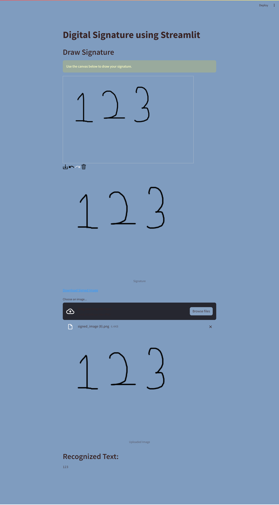

# HandWritten-Recognition
This Streamlit app allows you to draw a signature or upload an image for text recognition using Tesseract OCR.



## Installation

1. Clone the repository:

   ```bash
   git clone https://github.com/rsharvesh16/HandWritten-Recognition.git
   cd HandWritten-Recognition
2. Create a Virtual Environment:
   ```bash
   python -m venv your_env_name
   your_env_name/Scripts/activate
   Then Run pip install -r requirements.txt
3. Download Bin File of the below link:
   ```bash
    -> https://github.com/UB-Mannheim/tesseract/wiki
    -> Remember the path while you are setting up Tesseract application
    -> Run pip install pytesseract
    -> Make sure you add this command in your script : pytesseract.pytesseract.tesseract_cmd = r'C:\Users\USER\AppData\Local\Tesseract-OCR\tesseract.exe' (Your path may vary, Choose the Correct Path)

4. Run the command:
   ```bash
   streamlit run app.py

5. Make use of the app and if you like it, give it a star. To connect with me:

   - [LinkedIn](https://linkedin.com/in/rsharvesh16)
   - [Twitter](https://twitter.com/rsharvesh16)
  
